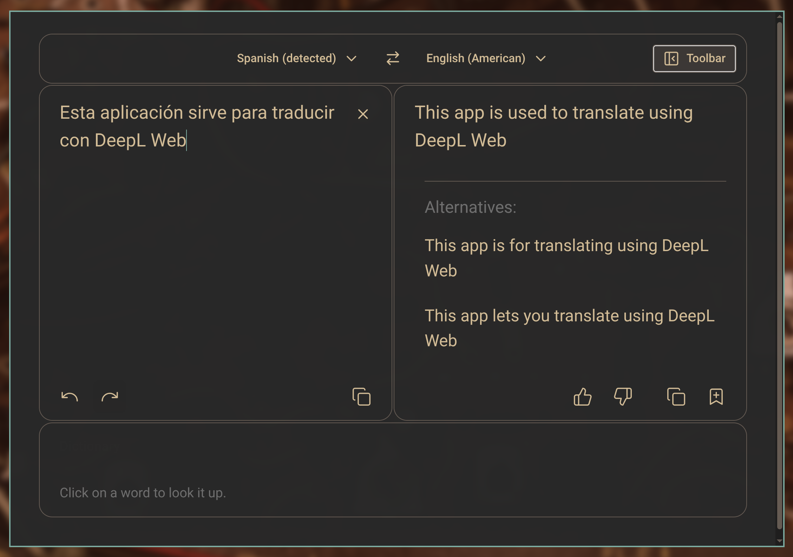

# DeepL Clipboard for Omarchy

An unofficial clipboard translator that integrates the DeepL web translator
with the Omarchy desktop. Copy text, press `Ctrl+Alt+C` or click the bar icon,
and the text is inserted into a compact, floating translator window.



The client follows the active Omarchy light or dark palette, preserves a
private DeepL login session, and uses the system Electron runtime. It is built
for Wayland and does not depend on Go, GTK WebKit, `xsel`, or `xdotool`.

## Features

- Reuses one centered, floating translator window.
- Reads the clipboard only when explicitly launched.
- Accepts only advertised plain-text clipboard formats; images and other
  binary formats open an empty translator instead of being submitted.
- Supports clipboard text from browsers and other Wayland applications.
- Preserves DeepL login cookies in a private application profile.
- Applies the current Omarchy color palette, including styled scrollbars.
- Hides the surrounding website for a compact translator-focused view.
- Provides an Omarchy bar widget and works with a Hyprland shortcut.
- Press `Ctrl+Shift+M` in the translator to toggle the full DeepL page.

## Requirements

- Omarchy with Hyprland and the Omarchy shell
- Electron (`electron43` is preferred and tested; `electron` is also detected)
- `wl-clipboard`
- `libnotify` (used only when clipboard text cannot be read)

## Install

Install and enable the plugin from its public GitHub repository:

```bash
omarchy plugin add https://github.com/cbayschm74/deepl-omarchy --enable
```

The plugin is self-contained in Omarchy's user plugin directory. Move it to
the desired bar section if needed:

```bash
omarchy bar move io.github.cbayschm74.deepl-clipboard --section right
```

Add the keyboard shortcut to `~/.config/hypr/bindings.lua`:

```lua
o.bind(
  "CTRL + ALT + C",
  "Translate clipboard with DeepL",
  os.getenv("HOME") .. "/.config/omarchy/plugins/io.github.cbayschm74.deepl-clipboard/launch.sh"
)
```

Add the floating window rule to `~/.config/hypr/hyprland.lua`:

```lua
o.window("^deepl-omarchy$", {
  float = true,
  center = true,
  size = { 1100, 760 },
})
```

Reload and validate Hyprland after editing its configuration:

```bash
hyprctl reload
hyprctl configerrors
```

## Account and first use

A DeepL account is not technically required for ordinary translation, but
DeepL may present repeated human-verification challenges to logged-out embedded
browsers. Signing in is therefore recommended for a smoother experience.

The first launch with a new profile shows the complete DeepL page so free and
paid users can sign in through DeepL's normal login flow. Press `Ctrl+Shift+M`
to switch between the complete page and compact translator at any time. The
account session remains available between launches in
`~/.local/share/deepl-omarchy`.

## Remove

Remove the plugin with:

```bash
omarchy plugin remove io.github.cbayschm74.deepl-clipboard
```

Remove the keyboard shortcut and window rule you added to the Hyprland files,
then reload Hyprland. To also forget the optional DeepL login, close the
translator and remove `~/.local/share/deepl-omarchy`.

## Privacy and security

Clipboard text is handed to Electron through a mode-`0600` request file under
the current user's Wayland runtime directory. Electron copies it into memory
and immediately clears the text from that file. Requests larger than 1 MiB are
discarded before Electron starts, and the translator opens empty. Clipboard
contents are not logged. Clipboard helpers have fixed deadlines, and Electron
opens request and theme files without following symbolic links, validates the
opened descriptor, and caps bytes before UTF-8 decoding. Theme values are
restricted to the supported light/dark modes and hexadecimal colors.

The persistent browser profile is stored outside the repository at
`~/.local/share/deepl-omarchy`. Never commit that directory. Text submitted
for translation is processed by DeepL under DeepL's own terms and privacy
policy.

## Acknowledgements

This project was inspired by Kumakichi's archived
[Deepl-linux](https://github.com/kumakichi/Deepl-linux) project and its
[MIT-licensed Electron successor](https://github.com/kumakichi/Deepl-linux-electron).
Thank you to Kumakichi for the original Linux clipboard-translation workflow.

No source code or assets from the archived Go repository are included in this
project.

## Disclaimer

This is an unofficial community project. It is not affiliated with, endorsed
by, or sponsored by DeepL SE. DeepL is a trademark of DeepL SE.

## License

MIT. See [LICENSE](LICENSE).
